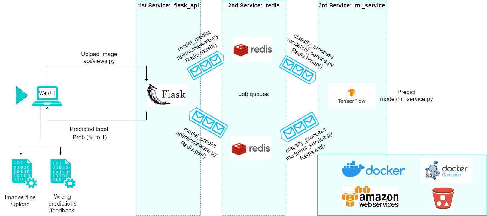

<p align="center">
    
</p>

<p align="center">
    <a href="https://github.com/agusle/image_classifier/commits/main">
    
    <a href="https://github.com/agusle/image_classifier/issues">
    
    <a href="https://github.com/agusle/image_classifier/pulls">
    
</p>

<p align="center">
  <a href="#-about">About</a> • 
  <a href="#%EF%B8%8F-install-and-run">Install and Run</a> •
  <a href="#-usage">Usage</a> •
  <a href="#-contribute">Contribute</a> •
</p>

------------------

## 📖 About
- **Problem**: Machine or deep learning model deployment. Let's say that I have already created a model or use an existing model and I have to figure out how it should or could be used.

- **Industries**: e-commerce, insurtech, goverment many others related.

- **Solution**: For anybody that has done any web work in the last decade, the solution will be obvious: let's build a web-service with an API that the web development team will know how to integrate with. This approach decouples the problem, solution and implementation! But let's go beyond the simple of approach where you have a website that accepts a file upload and runs some code to process the file on the web server. Let's create a better, more robust and scalable system! A simple flow diagram of the possible solution:



This architecture can easily be replicated and run on your local development machine using docker containers and it will work and behave like the real thing.

------------------

## ⚡️ Install and Run 

Listed below you'll find an example or application usage to run the services using compose.

You can use [`Docker`](https://www.docker.com/) to easily install all the needed packages and libraries:

### Run Services

```bash
$ docker-compose up --build -d
```

To stop the services:

```bash
$ docker-compose down
```

### Tests

#### Integration end-to-end

You must have the full pipeline running and [requests](https://docs.python-requests.org/en/latest/) library installed. Then, from this project root folder run:

```
$ python tests/test_integration.py
```

#### Modules

I made use of [multi-stage docker builds](https://docs.docker.com/develop/develop-images/multistage-build/) so we can have into the same Dockerfile environments for testing and also for deploying our service.

#### API

Run:

```bash
$ cd api/
$ docker build -t flask_api_test --progress=plain --target test .
```

You will only need to pay attention to the logs corresponding to the testing code which will look like this:

```bash
#10 [test 1/1] RUN ["pytest", "-v", "/src/tests"]
#10 sha256:707efc0d59d04744766193fe6873d212afc0f8e4b28d035a2d2e94b40826604f
#10 0.537 ============================= test session starts ==============================
#10 0.537 platform linux -- Python 3.8.13, pytest-7.1.1, pluggy-1.0.0 -- /usr/local/bin/python
#10 0.537 cachedir: .pytest_cache
#10 0.537 rootdir: /src
#10 0.537 collecting ... collected 4 items
#10 0.748
#10 0.748 tests/test_api.py::TestIntegration::test_bad_parameters PASSED           [ 25%]
#10 0.757 tests/test_api.py::TestEnpointsAvailability::test_feedback PASSED        [ 50%]
#10 0.769 tests/test_api.py::TestEnpointsAvailability::test_index PASSED           [ 75%]
#10 0.772 tests/test_api.py::TestEnpointsAvailability::test_predict PASSED         [100%]
#10 0.776
#10 0.776 ============================== 4 passed in 0.24s ===============================
#10 DONE 0.8s
```

You are good if all tests are passing.

#### Model

Same as api, run:

```bash
$ cd model/
$ docker build -t model_test --progress=plain --target test .
```
------------------

## 👀 Usage

## Part 1 - Building the basic service

On this project, I will code and deploy an API for serving our own machine learning models. For this particular case, it will be a [Convolutional Neural network for images (ResNet50)](https://tfhub.dev/tensorflow/resnet_50/classification/1).

Below is the full project structure:

```
├── api
│   ├── Dockerfile
│   ├── app.py
│   ├── middleware.py
│   ├── views.py
│   ├── settings.py
│   ├── utils.py
│   ├── templates
│   │   └── index.html
│   └── tests
│       ├── test_api.py
│       └── test_utils.py
├── model
│   ├── Dockerfile
│   ├── ml_service.py
│   ├── settings.py
│   └── tests
│       └── test_model.py
├── stress_test
│   └── locustfile.py
├── docker-compose.yml
├── README.md
└── tests
    └── test_integration.py
```

Let's take a quick overview on each module:

- api: It has all the needed code to implement the communication interface between the users and our service. It uses Flask and Redis to queue tasks to be processed by our machine learning model.
    - `api/app.py`: Setup and launch our Flask api.
    - `api/views.py`: Contains the API endpoints. You must implement the following endpoints:
        - *upload_image*: Displays a frontend in which the user can upload an image and get a prediction from our model.
        - *predict*: POST method which receives an image and sends back the model prediction. This endpoint is useful for integration with other services and platforms given we can access it from any other programming language.
        - *feedback*: Endpoint used to get feedback from users when the prediction from our model is incorrect.
    - `api/utils.py`: Implements some extra functions used internally by our api.
    - `api/settings.py`: It has all the API settings.
    - `api/templates`: Here we put the .html files used in the frontend.
    - `api/tests`: Test suite.
- model: Implements the logic to get jobs from Redis and process them with our Machine Learning model. When we get the predicted value from our model, we must encole it on Redis again so it can be delivered to the user.
    - `model/ml_service.py`: Runs a thread in which it get jobs from Redis, process them with the model and returns the answers.
    - `model/settings.py`: Settings for our ML model.
    - `model/tests`: Test suite.
- tests: This module contains integration tests so we can properly check our system end-to-end behavior is the expected.

The communication between our services (*api* and *model*) will be done using *Redis*. Every time *api* wants to process an image, it will store the image on disk and send the image name through Redis to the *model* service. *model* already knows in which folder images are being store, so it only has to use the file name to load it, get predictions and return the results back to *api*.

## Part 2 - Stress testing with [*Locust*](https://locust.io/)

For this task, you must see the files `locustfile.py` from `stress_test` folder. 

### Test scaled services

You can easily launch more instances for a particular service using `--scale SERVICE=NUM` when running `docker-compose up` command (see [here](https://docs.docker.com/compose/reference/up/)). Scale `model` service to 2 or even more instances and check the performance with locust.

Here is a [short report](https://github.com/agusle/image_classifier/blob/main/stress_test/stress_test_report.md) detailing the hardware specs from the server used to run the service and show a comparison in the results obtained for different number of users being simulated and instances deployed.

## Part 3 - Getting feedback from users

The `/feedback` endpoint is useful so the users can report using the service UI when a model prediction is wrong. Store the reported image path and the model prediction to a `.csv` file inside the folder `/src/feedback` so we can access later to check those cases in which our Machine Learning model failed according to users.

------------------

## 👍 Contribute
**Please follow these steps to get your work merged in.**

1. Add a [GitHub Star](https://github.com/agusle/image_classifier) to the project.
2. Clone repo and create a new branch: `$ git checkout https://github.com/agusle/image_classifier -b name_for_new_branch.`
3. Add a feature, fix a bug, or refactor some code :)
4. Write/update tests for the changes you made, if necessary.
5. Update `README.md`, if necessary.
4. Submit Pull Request with comprehensive description of changes